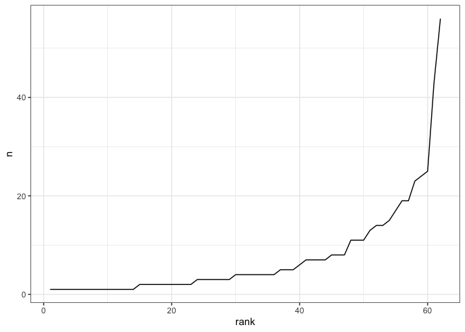
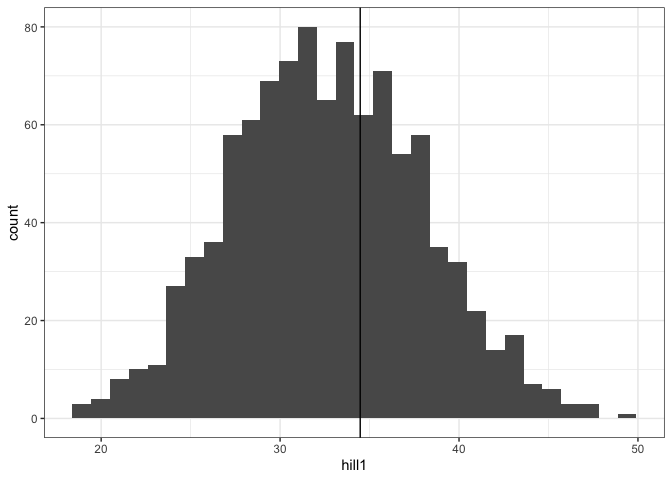
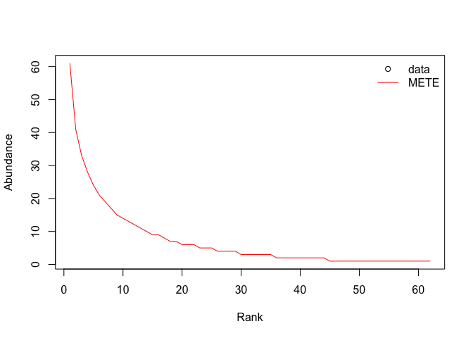
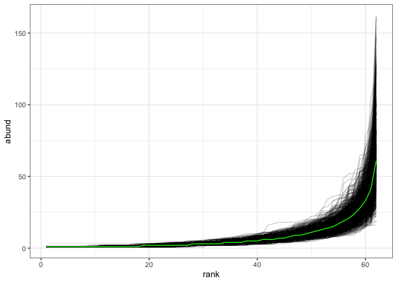
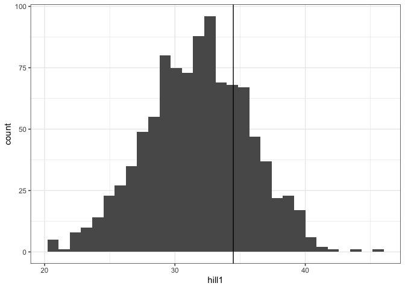
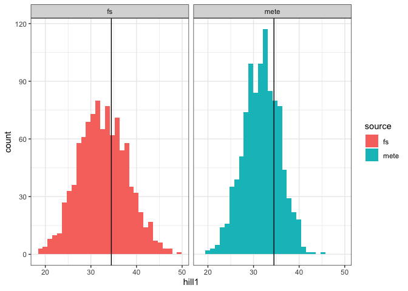

METE
================

Define the baseline as either 1) the feasible set or 2) METE
expectation.

For a given dataset…

``` r
bird_sad <- read.csv(here::here("data", "bird_sad.csv"))

ggplot(bird_sad, aes(rank, n)) +
  geom_line()
```

<!-- -->

``` r
s <- nrow(bird_sad)
n <- sum(bird_sad$n)
hill1 <- hillR::hill_taxa(bird_sad$n, q = 1)
```

We can define a baseline SAD either using the feasible set or METE.

``` r
fs <- feasiblesads::sample_fs(s, n, nsample = 1000, storeyn = FALSE)

fs_df <- fs %>%
  t() %>%
  as.data.frame() %>%
  mutate(rank = dplyr::row_number()) %>%
  tidyr::pivot_longer(-rank, names_to ="draw", values_to = "abund")

ggplot(fs_df, aes(rank, abund, group = draw)) +
  geom_line(alpha = .2) +
  geom_line(data = bird_sad, aes(rank, n), color = "green", inherit.aes = F) +
  ggtitle("Feasible set")
```

<!-- -->

``` r
fs_summary_df <- fs_df %>%
  group_by(draw) %>%
  summarize(hill1 = hillR::hill_taxa(abund, q = 1)) %>%
  ungroup()

ggplot(fs_summary_df, aes(hill1)) +
  geom_histogram() +
  geom_vline(xintercept = hill1)
```

    ## `stat_bin()` using `bins = 30`. Pick better value with `binwidth`.

<!-- -->

Calculating divergence from the feasible set is a little tricky. One can

-   look for a central tendency
-   look for some kind of p() each value
-   calculate p of some summary statistic

A starting point is to calculate the percentile value of a summary
statistic.

``` r
percentile <- function(x, comparison) {
  
  return(mean(comparison <= x))
  
}

percentile(hill1, fs_summary_df$hill1)
```

    ## [1] 0.633

We can also use METE.

``` r
library(meteR)

mete_esf <- meteESF(S0 = s, N0 = n)

mete_sad <- sad(mete_esf)

plot(mete_sad, ptype = "rad")
```

    ## Warning in sprintf(xlab, switch(x$type, sad = "Abundance", ipd = "Metabolic
    ## rate", : one argument not used by format 'Rank'

<!-- -->

``` r
mete_sad_rank <- data.frame(
  rank = s:1,
  abund = meteDist2Rank(mete_sad))

mete_sad_draws <- replicate(n = 1000, sort(mete_sad$r(s)), simplify = T) %>%
  as.data.frame() %>%
  mutate(rank = dplyr::row_number()) %>%
  tidyr::pivot_longer(-rank, names_to = "draw", values_to = "abund")


ggplot(mete_sad_draws, aes(rank, abund, group = draw)) +
  geom_line(alpha = .2) +
  geom_line(data = mete_sad_rank, aes(rank, abund), color = "green", inherit.aes = F)
```

<!-- -->

``` r
mete_sad_draws_summary <- mete_sad_draws %>%
  group_by(draw) %>%
  summarize(hill1 = hillR::hill_taxa(abund, q =1 )) %>%
  ungroup()


ggplot(mete_sad_draws_summary, aes(hill1)) +
  geom_histogram() +
    geom_vline(xintercept = hill1)
```

    ## `stat_bin()` using `bins = 30`. Pick better value with `binwidth`.

<!-- -->

``` r
percentile(hill1, mete_sad_draws_summary$hill1)
```

    ## [1] 0.748

``` r
all_draws <- fs_df %>%
  mutate(source = "fs") %>%
  bind_rows(mutate(mete_sad_draws, source = "mete")) %>%
  mutate(sourcedraw = paste(source, draw))

ggplot(all_draws, aes(rank, abund, group = sourcedraw, color = source)) +
  geom_line(alpha = .1)
```

<!-- -->

``` r
all_draws_summary <- fs_summary_df %>%
  mutate(source = "fs") %>%
  bind_rows(mutate(mete_sad_draws_summary, source = "mete"))

ggplot(all_draws_summary, aes(hill1, fill = source)) +
  geom_histogram() +
  geom_vline(xintercept = hill1) +
  facet_wrap(vars(source))
```

    ## `stat_bin()` using `bins = 30`. Pick better value with `binwidth`.

<!-- -->

It may be an imperfect workflow, but a suggestion is to compare the %ile
values of observed vs. FS and vs. METE.

Pseudo workflow:

``` r
percentile_score <- function(x, comparison) {}

fs_vals <- function(s, n, ndraws, sumstat) {}

mete_vals <- function(s, n, ndraws, sumstat) {}

real_val <- function(sad) {}

get_s <- function(sad) {}

get_n <- function(sad) {}

full_workflow <- function(sad, ndraws = 1000, sumstat = "hill_1") {
  
  s = get_s(sad)
  n = get_n(sad)
  
  real_v <- real_val(sad)
  
  fs_v <- fs_vals(s, n, ndraws = ndraws, sumstat = sumstat)
    mete_v <- mete_vals(s, n, ndraws = ndraws, sumstat = sumstat)

  out <- data.frame(
    s = s,
    n = n,
    real_v = real_v,
    fs_percentile = percentile(real_v, fs_v),
    mete_percentile = percentile(real_v, mete_v)
  )
  
  return(out)
}

# then some fxns to wrap datasets into sads and keep track of metadata
```
