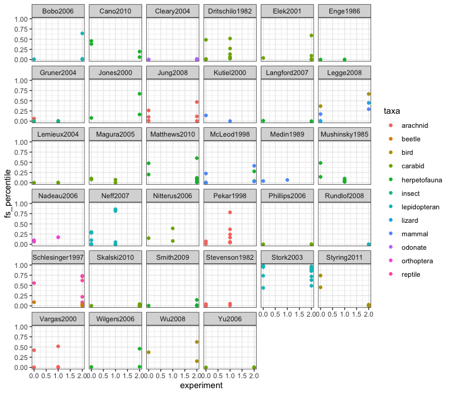
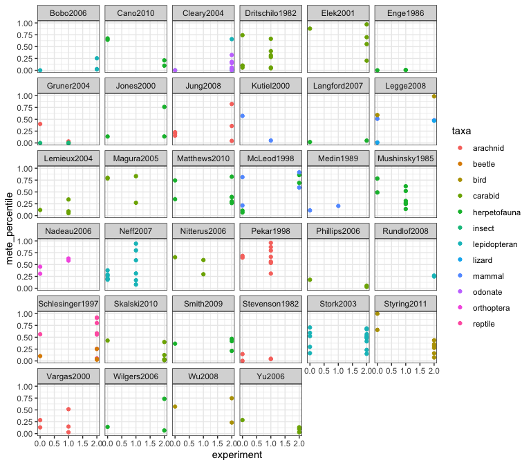

MACD results explorer
================
2022-10-26

<!-- -->

<!-- -->

- change in S and N?
- taxa
- experiment, system type

Would prefer something more standardized, at least as a starting point.

Off the cuff…

- a lot of things *do* deviate
- deviations are more pronounced for FS vs METE
- but I don’t see a simple obvious clear pattern of the manipulated
  sites (`experiment` = 1 or 2 in these plots) being more unusual (lower
  %ile score) than the control sites.
