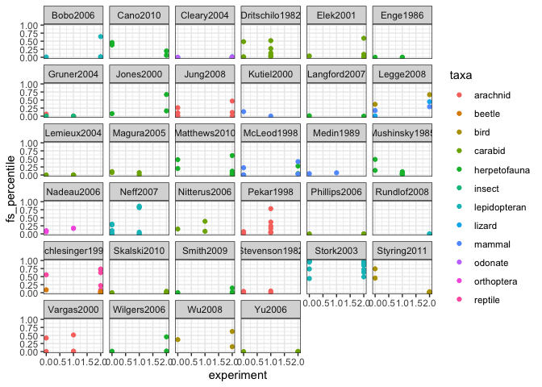
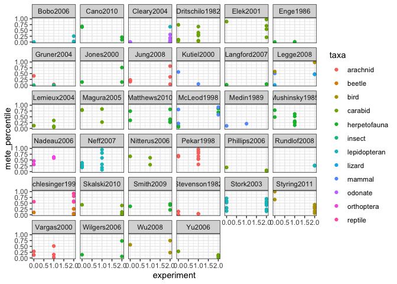
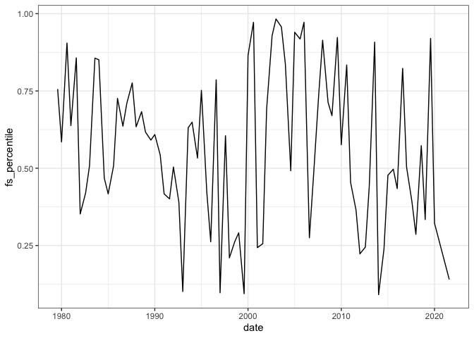
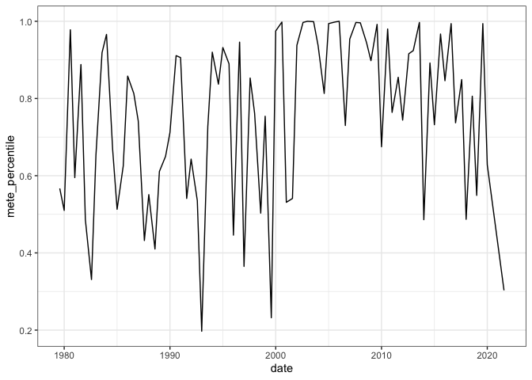

SADs Divergence Report
================
Renata Diaz
July, 2023

## Context

This is a summary of research conducted by Renata Diaz as part of NSF
fellowship award DBI-2208901.

## Conceptual background

Under the concept of “statistical equilibrium”, complex systems -
including ecological systems - may be expected to exhibit consistent
emergent behavors at the macroscopic scale, even in the absence of
strong disruptive or structure processes at the microscale (Siegert
1949; Jaynes 1957). An excellent example of this appears to be the
ecological species abundance distribution, which consistently shows a
“hollow-curve” whether in empirical or theoretically-generated systems
(Nekola and Brown 2007). The “hollow-curve” species abundance
distribution may be a kind of attractor or statistical equilibrium for
ecological systems, meaning that, in the absence of any particularly
strong force at play in the system, the SAD can be expected to conform
to a hollow-curve shape.

One prediction from this framework is that, when there *is* a strong
disruptive force operating in a system, that the SAD may then deviate
more pronouncedly from statistical equilibrium than in a system not
undergoing a disruption or disturbance (see also Newman et al 2020;
Rominger et al 2015).

This analyses tests this prediction using data from the [Manipulated
Animal Community
Database](https://figshare.com/articles/dataset/Manipulated_Animal_Community_Database/969831)
(Supp 2014) and the [Portal
Project](https://github.com/weecology/PortalData) (Ernest et al 2020).

## Methods

### Characterizing statistical equilibrium

Statistical equilibrium is characterized here using two frameworks: the
[feasible set](https://onlinelibrary.wiley.com/doi/10.1111/ele.12154)
(Locey and White 2013) and the [Maximum Entropy Theory of
Ecology](https://global.oup.com/academic/product/maximum-entropy-and-ecology-9780199593422?cc=us&lang=en&)(Harte
2011).

### Comparing data to statistical equilibrium

For a given combination of S and N, we generate SADs from these null
baselines (using the `feasiblesads` R package for the feasible set, and
`meteR` for MaxEnt) (Diaz and Ye 2020; Rominger et al 2014). We then
compute summary statistics (the Hill number of order 1) on the
equilibrium SADs and the observed SAD, and calculate the percentile
score of the observed SAD compared to the equilibrium SADs. Percentile
scores very low (e.g. \<2.5) indicate an observed SAD with an improbably
low Hill number; very high percentile scores (\>97.5) indicate
improbably high Hill numbers.

The prediction is that “perturbed” communities will have a greater
representation of improbably high or low Hill numbers than
“non-perturbed” communities. For the MACD data, we understand “control”
communities to be unperturbed and experimentally manipulated communities
to be “perturbed” (Supp 2014). For the Portal Project data, we know
there to have been [major perturbations to community
structure](https://www.jstor.org/stable/26625765) in the late 1980s, the
mid-1990s, approximately 2000, and 2010 (Christensen et al 2018).

## Results

### MACD

``` r
library(dplyr)
```

    ## 
    ## Attaching package: 'dplyr'

    ## The following objects are masked from 'package:stats':
    ## 
    ##     filter, lag

    ## The following objects are masked from 'package:base':
    ## 
    ##     intersect, setdiff, setequal, union

``` r
library(ggplot2)
theme_set(theme_bw())
data = read.csv(here::here("results", "macd_results.csv"))


ggplot(data, aes(experiment, fs_percentile, color = taxa)) +
  geom_point() +
  facet_wrap(vars(referenceID))
```

<!-- -->

``` r
ggplot(data, aes(experiment, mete_percentile, color = taxa)) +
  geom_point() +
  facet_wrap(vars(referenceID))
```

<!-- -->

The prediction would be that experiment = 1 or experiment = 2 (natural
or human-mediated manipulations; see Supp (2014) and metadata) would be
more extreme than experiment = 0 (control). While deviations are common,
there is not a clear and widespread signal of these extreme values being
more prevalent for experiment != 0.

## Portal data

``` r
data = read.csv(here::here("results", "portal_rodent_results.csv"))

data <- data %>% mutate(month = ifelse(substr(siteID, 0, 1) == "w", "01", "08"),
                        year = (substr(siteID, 7, 11)),
                        day = "01") %>%
  mutate(date = paste(year, month, day, sep = "-")) %>%
  mutate(date =as.Date(date))


ggplot(data, aes(date, fs_percentile)) +
  geom_line() 
```

<!-- -->

``` r
ggplot(data, aes(date, mete_percentile)) +
  geom_line()
```

<!-- -->

The prediction would be that the reorganization dates (mid-1980s,
mid-1990s, 2000, 2010) would show pronouncedly high or low percentile
scores. There is not clear support for this prediction - although,
again, deviations are not uncommon in general.

## Discussion

In this pilot analysis, there is not a clear signal of support for the
prediction of “disturbances”, widely defined, corresponding to
pronounced deviations from either the feasible set or MaxEnt. However,
such deviations are not uncommon in the empirical data.

This raises several possible questions and considerations for future
investigation:

1.  Would a more targeted empirical analysis show more conclusive
    support (or non-support) for these predictions? In particular,
    working with a dataset for which the “control” group can be
    reasonably expected to correspond to an *equilibrial* state of the
    system. In these data, the control or non-disturbed groups are
    simply those that haven’t been subject to a recent manipulation or a
    known reorganization event. This does not necessarily mean they are
    at equilibrium. A more targeted data set - e.g. a forest dynamics
    plot, or, even better, microcosm/mesocosm data - could provide a
    more definitive answer.
2.  Provided the general pattern here holds, it is notable that even
    “unperturbed” systems deviate from statistical equilibrium. It may
    be that deviations from statistical equilibium are more the norm
    than the exception, even for biological systems at ~equilibrium.
    This may mean that biological processes, played out to equilibrium,
    may lead us to a baseline that differs from what we arrive at
    through purely statistical (e.g. the feasible set) or
    minimally-biologically-informed (e.g. MaxEnt) theories. This could
    be more fully tested by (1) explicitly comparing the outcomes of
    simple ecological null models to these statistical baselines (work
    taken up in diazrenata/feasible-catch) and (2) simulation exercises
    comparing neutral and competitive models to statistical baselines
    (intended work using the [RoLE
    model](https://github.com/role-model/roleR)).

## References

Christensen, E. M., Harris, D. J., & Ernest, S. K. M. (2018). Long-term
community change through multiple rapid transitions in a desert rodent
community. Ecology, 99(7), 1523–1529. <https://doi.org/10.1002/ecy.2373>

Diaz, R., & Ye, H. (2021). diazrenata/feasiblesads: Feasiblesads
\[Computer software\]. Zenodo. <https://doi.org/10.5281/zenodo.4710750>

Ernest, S. K. M., Yenni, G. M., Allington, G., Bledsoe, E. K.,
Christensen, E. M., Diaz, R. M., Geluso, K., Goheen, J. R., Guo, Q.,
Heske, E., Kelt, D., Meiners, J. M., Munger, J., Restrepo, C., Samson,
D. A., Schutzenhofer, M. R., Skupski, M., Supp, S. R., Thibault, K., …
Valone, T. J. (2020). The Portal Project: A long-term study of a
Chihuahuan desert ecosystem. BioRxiv, 332783.
<https://doi.org/10.1101/332783>

Harte, J. (2011). Maximum Entropy and Ecology: A Theory of Abundance,
Distribution, and Energetics. Oxford University Press.
<https://doi.org/10.1093/acprof:oso/9780199593415.001.0001>

Jaynes, E. T. (1957). Information Theory and Statistical Mechanics.
Physical Review, 106(4), 620–630.
<https://doi.org/10.1103/PhysRev.106.620>

Locey, K. J., & White, E. P. (2013). How species richness and total
abundance constrain the distribution of abundance. Ecology Letters,
16(9), 1177–1185. <https://doi.org/10.1111/ele.12154>

Nekola, J. C., & Brown, J. H. (2007). The wealth of species: Ecological
communities, complex systems and the legacy of Frank Preston. Ecology
Letters, 10(3), 188–196.
<https://doi.org/10.1111/j.1461-0248.2006.01003.x>

Newman, E. A., Wilber, M. Q., Kopper, K. E., Moritz, M. A., Falk, D. A.,
McKenzie, D., & Harte, J. (2020). Disturbance macroecology: A
comparative study of community structure metrics in a high-severity
disturbance regime. Ecosphere, 11(1), e03022.
<https://doi.org/10.1002/ecs2.3022>

Rominger, A. J., Goodman, K. R., Lim, J. Y., Armstrong, E. E., Becking,
L. E., Bennett, G. M., Brewer, M. S., Cotoras, D. D., Ewing, C. P.,
Harte, J., Martinez, N. D., O’Grady, P. M., Percy, D. M., Price, D. K.,
Roderick, G. K., Shaw, K. L., Valdovinos, F. S., Gruner, D. S.,
Gillespie, R. G., & Ricklefs, R. (2016). Community assembly on isolated
islands: Macroecology meets evolution. Global Ecology and Biogeography,
25(7), 769–780. <https://doi.org/10.1111/geb.12341>

Rominger, A., Merow, Cory, & Harte, John. (2014). MeteR: Analysis with
the maximum entropy theory of ecology \[Manual\].

Siegert, A. J. F. (1949). On the Approach to Statistical Equilibrium.
Physical Review, 76(11), 1708–1714.
<https://doi.org/10.1103/PhysRev.76.1708>

Supp, S. (2014). Manipulated Animal Community Database. Figshare.
<https://doi.org/10.6084/m9.figshare.969831.v1>
